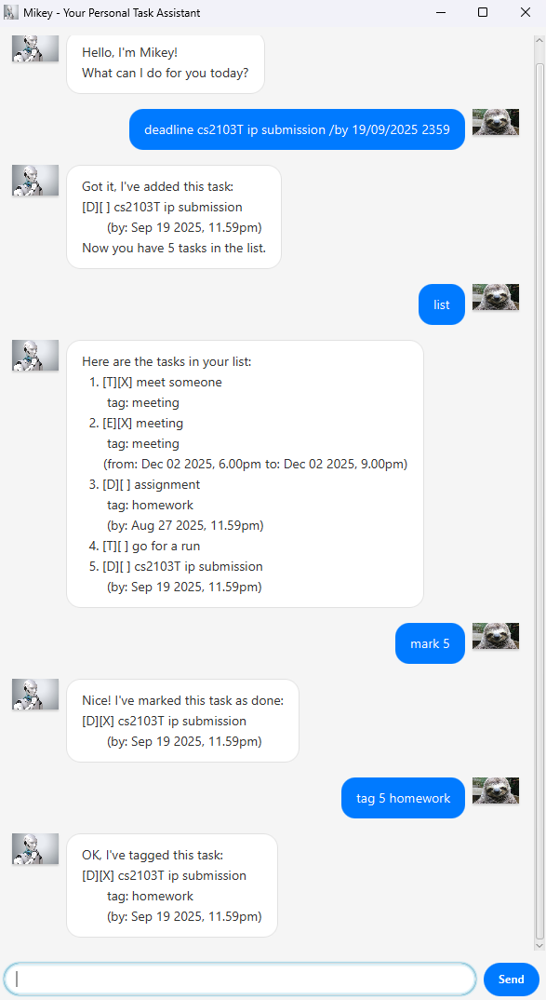

# Mikey User Guide



Mikey is your personal assistant for your everyday life!

--- 

# Features

## Feature 1: Adding tasks

### Three types of tasks are available
1. Todo tasks
2. Deadline tasks
3. Event tasks

Usage:

1. Todo: `todo <description>`
2. Deadline: `deadline <description> /by <DateTimeFormat>`
3. Event: `event <description> /from <DateTimeFormat> /to <DateTimeFormat>`

Example usages:
1. `todo go for a run`
2. `deadline submit assignment /by 19/9/2025 2359`
3. `event meet friends /from 15/9/2025 1200 /to 15/9/2025 1800`
> Note that the DateTimeFormat must follow the above format


## Feature 2: Adding tasks

Usage: `list`

Example output:

``` 
Here are the tasks in your list: 
    1. [T][] go for a run
    2. [D][X] submit assignment
        (by: Sep 19 2025, 11.59pm)
    3. [E][] meet friends
        (from: Sep 15 2025, 12.00pm to: Sep 15 2025, 6.00pm)
```

## Feature 3: Deleting tasks
 

Usage: `delete <index>`

Example usage: `delete 2`

## Feature 4: Mark/Unmark task as done

Usage:
* `mark <index>`
* `unmark <index>`

Example usage:
* `mark 2`
* `unmark 2`

## Feature 5: Find task

Usage: `find <keyword>`

Example usage: `find meet`
> Mikey will output all tasks that contains the keyword "meet"

## Feature 6: Tag task

Usage: `tag <index> <label>`

Example usage: `tag 2 homework`


## Feature 7: Exit app

Usage: `bye`
> This will exit the app automatically!